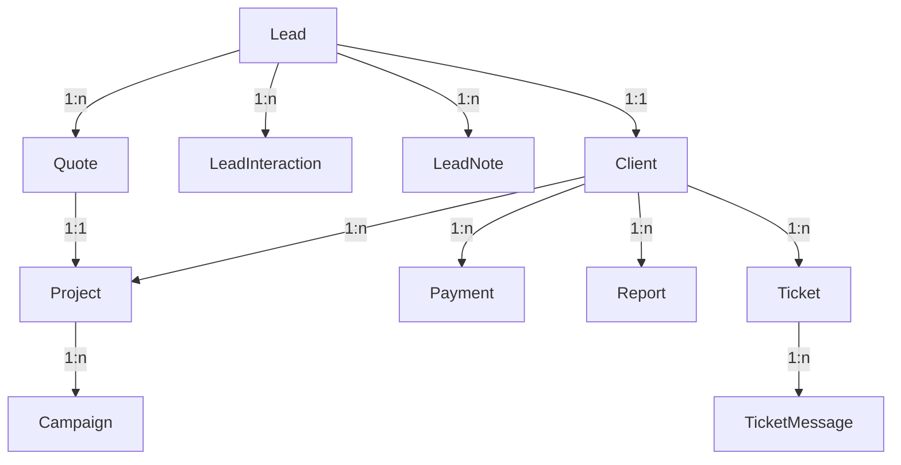

# 📐 PROJECT ARCHITECTURE DOCUMENTATION

## 🏗️ Architecture Overview

This document provides a comprehensive overview of the Marketing Platform architecture, explaining how each component works together to create a high-converting, mobile-first digital marketing service platform.

## 🎯 Business Purpose

**Core Business Model**: Automated lead generation and client management for digital marketing services (Google Ads, Facebook Ads, TikTok Ads).

**Key Business Goals**:
- Convert >5% of visitors to qualified leads
- Automate quote generation and follow-up
- Streamline client onboarding and management
- Track campaign performance and ROI

## 🗂️ Project Structure

```
marketing-platform/
├── src/
│   ├── app/                    # Next.js 15.5 App Router
│   │   ├── (landing)/          # Public landing pages
│   │   ├── (dashboard)/        # Protected client area
│   │   ├── (admin)/           # Admin panel
│   │   ├── api/               # API routes
│   │   └── globals.css        # Global styles (Tailwind 4.1)
│   ├── components/
│   │   ├── ui/               # Design system components
│   │   ├── landing/          # Landing page components
│   │   ├── forms/            # Form components
│   │   └── dashboard/        # Dashboard components
│   ├── lib/
│   │   ├── supabase/         # Supabase client & helpers
│   │   ├── prisma/           # Prisma client
│   │   ├── utils.ts          # Utility functions
│   │   └── hooks/            # Custom React hooks
│   └── types/                # TypeScript type definitions
├── prisma/
│   └── schema.prisma         # Database schema
├── supabase/
│   ├── functions/           # Edge functions
│   └── migrations/          # Database migrations
└── public/                  # Static assets
```

## 🛢️ Database Architecture

### Core Models & Relationships



### Model Purposes

| Model | Purpose | Business Impact |
|-------|---------|-----------------|
| **Lead** | Store potential customer information | Core conversion funnel, lead scoring |
| **LeadInteraction** | Track all touchpoints with leads | Understand customer journey |
| **Quote** | Automated pricing proposals | Speed up sales process |
| **Client** | Active customer management | Retention & lifetime value |
| **Project** | Active campaign management | Service delivery tracking |
| **Campaign** | Individual ad campaign metrics | Performance monitoring |
| **Payment** | Financial transactions | Revenue tracking |
| **Report** | Performance reports | Client transparency |
| **Ticket** | Support system | Customer satisfaction |

## 🎨 Component Architecture

### Design System Components (`/components/ui/`)

| Component | Purpose | Mobile Optimization |
|-----------|---------|---------------------|
| **Button** | CTA interactions | 44px min touch target, loading states |
| **Input** | Form fields | Touch-friendly, auto-complete support |
| **Card** | Content containers | Responsive padding, touch scrolling |
| **Modal** | Overlays & dialogs | Full-screen on mobile |
| **Toast** | Notifications | Bottom position on mobile |

### Landing Components (`/components/landing/`)

| Component | Purpose | Conversion Feature |
|-----------|---------|-------------------|
| **HeroSection** | First impression | Value prop, social proof, CTA |
| **ServicesGrid** | Service showcase | Interactive pricing hints |
| **ContactForm** | Lead capture | Multi-step, lead scoring |
| **PortfolioShowcase** | Case studies | Before/after metrics |
| **TestimonialsCarousel** | Social proof | Swipe gestures on mobile |
| **CTASection** | Conversion points | Sticky on mobile scroll |

### Dashboard Components (`/components/dashboard/`)

| Component | Purpose | User Experience |
|-----------|---------|-----------------|
| **MetricsCard** | KPI display | Real-time updates |
| **CampaignTable** | Campaign overview | Mobile-optimized table |
| **ReportViewer** | Performance reports | PDF generation |
| **TicketList** | Support tickets | Priority indicators |

## 🔄 Data Flow

### Lead Generation Flow

```
1. Visitor lands on page
   ↓
2. HeroSection presents value proposition
   ↓
3. ContactForm captures lead information
   ↓
4. Lead scoring algorithm evaluates quality
   ↓
5. Lead saved to database with score
   ↓
6. Automated email follow-up triggered
   ↓
7. Quote generated based on requirements
   ↓
8. Sales team notified for high-score leads
```

### Client Portal Flow

```
1. Client logs in via Supabase Auth
   ↓
2. Dashboard loads client data
   ↓
3. Real-time metrics displayed
   ↓
4. Reports generated on-demand
   ↓
5. Support tickets manageable
   ↓
6. Payment history accessible
```

## 🚀 Performance Optimizations

### Mobile-First Strategies
- **CSS**: Tailwind 4.1 with mobile-first breakpoints
- **Images**: WebP/AVIF with lazy loading
- **Fonts**: System fonts with font-display: swap
- **Bundle**: Code splitting per route
- **Animations**: GPU-accelerated transforms

### Core Web Vitals Targets
- **LCP**: <2.5s (Largest Contentful Paint)
- **FID**: <100ms (First Input Delay)
- **CLS**: <0.1 (Cumulative Layout Shift)
- **TTFB**: <600ms (Time to First Byte)

## 🔐 Security Architecture

### Authentication & Authorization
- **Public Routes**: Landing pages, quote calculator
- **Protected Routes**: Client dashboard, reports
- **Admin Routes**: Lead management, analytics
- **API Routes**: Rate limiting, CORS protection

### Data Protection
- **Encryption**: All sensitive data encrypted at rest
- **SSL/TLS**: Enforced HTTPS connections
- **RBAC**: Role-based access control
- **Audit Logs**: Track all data modifications

## 📊 Analytics & Tracking

### Business Metrics
```typescript
interface BusinessMetrics {
  conversionRate: number;      // Visitors → Leads
  leadScore: number;           // Lead quality (0-100)
  quoteAcceptance: number;     // Quotes → Clients
  clientLifetimeValue: number; // Average CLV
  churnRate: number;          // Monthly churn %
  nps: number;                // Net Promoter Score
}
```

### Technical Metrics
```typescript
interface TechnicalMetrics {
  pageLoadTime: number;       // Page load speed
  errorRate: number;          // Application errors
  apiLatency: number;         // API response time
  dbQueryTime: number;        // Database performance
  cacheHitRate: number;       // Cache effectiveness
}
```

## 🔗 Integration Points

### External Services
| Service | Purpose | Integration Type |
|---------|---------|------------------|
| **Supabase** | Auth, Database, Storage | SDK |
| **Stripe** | Payment processing | API |
| **SendGrid** | Email automation | API |
| **Twilio** | SMS notifications | API |
| **Analytics** | User tracking | Script |

### API Endpoints
```
/api/leads        - Lead management
/api/quotes       - Quote generation
/api/clients      - Client operations
/api/campaigns    - Campaign metrics
/api/reports      - Report generation
/api/webhooks     - External integrations
```

## 🎯 Business Logic

### Lead Scoring Algorithm
```typescript
function calculateLeadScore(lead: Lead): number {
  let score = 0;
  
  // Contact completeness (30 points)
  if (lead.email) score += 10;
  if (lead.phone) score += 10;
  if (lead.company) score += 10;
  
  // Budget (30 points)
  if (lead.budget === '10k+') score += 30;
  else if (lead.budget === '5k-10k') score += 20;
  else if (lead.budget === '1k-5k') score += 10;
  
  // Platform selection (20 points)
  score += Math.min(lead.platforms.length * 5, 20);
  
  // Engagement (20 points)
  if (lead.source === 'referral') score += 20;
  else if (lead.source === 'google') score += 10;
  
  return Math.min(score, 100);
}
```

### Quote Pricing Logic
```typescript
function calculateQuote(requirements: QuoteRequirements): Quote {
  const baseFee = 1000; // Base management fee
  let monthlyFee = baseFee;
  
  // Platform multipliers
  const platformFees = {
    google: 500,
    meta: 400,
    tiktok: 300,
    linkedin: 600
  };
  
  requirements.platforms.forEach(platform => {
    monthlyFee += platformFees[platform];
  });
  
  // Budget tier adjustments
  if (requirements.adSpend > 10000) {
    monthlyFee *= 1.5; // Premium service
  }
  
  // Setup fee (first month only)
  const setupFee = monthlyFee * 0.5;
  
  return {
    monthlyFee,
    setupFee,
    totalValue: monthlyFee * requirements.duration
  };
}
```

## 📈 Scalability Considerations

### Current Architecture (MVP)
- **Users**: 100-500 clients
- **Leads**: 1,000-5,000/month
- **Database**: PostgreSQL via Supabase
- **Hosting**: Vercel Edge Network

### Future Scaling Path
- **Users**: 5,000+ clients → Add Redis caching
- **Leads**: 50,000+/month → Queue processing
- **Database**: Add read replicas
- **Hosting**: Add CDN, consider dedicated infrastructure

## 🔄 Development Workflow

### Git Branch Strategy
```
main          → Production
├── staging   → Staging environment
└── develop   → Development
    ├── feature/[name]
    ├── fix/[issue]
    └── refactor/[component]
```

### Deployment Pipeline
1. **Local Development** → localhost:3000
2. **Pull Request** → Preview deployment
3. **Merge to staging** → Staging deployment
4. **Merge to main** → Production deployment

## 📝 Code Standards

### TypeScript Configuration
```typescript
{
  "strict": true,
  "noImplicitAny": true,
  "strictNullChecks": true,
  "noUnusedLocals": true,
  "noUnusedParameters": true
}
```

### Component Pattern
```typescript
interface ComponentProps {
  // Props with JSDoc comments
  /** Display variant */
  variant?: 'primary' | 'secondary';
  /** Loading state */
  loading?: boolean;
}

export function Component({ 
  variant = 'primary',
  loading = false 
}: ComponentProps) {
  // Implementation
}
```

## 🎯 Success Metrics

### Technical Success
- ✅ Lighthouse score >90
- ✅ Zero accessibility violations
- ✅ <3s load time on 3G
- ✅ 60fps animations
- ✅ TypeScript strict mode

### Business Success
- ✅ >5% conversion rate
- ✅ <30 days to ROI
- ✅ >80% client retention
- ✅ >50 NPS score
- ✅ <2h support response

---

*This architecture document is a living document and will be updated as the project evolves.*